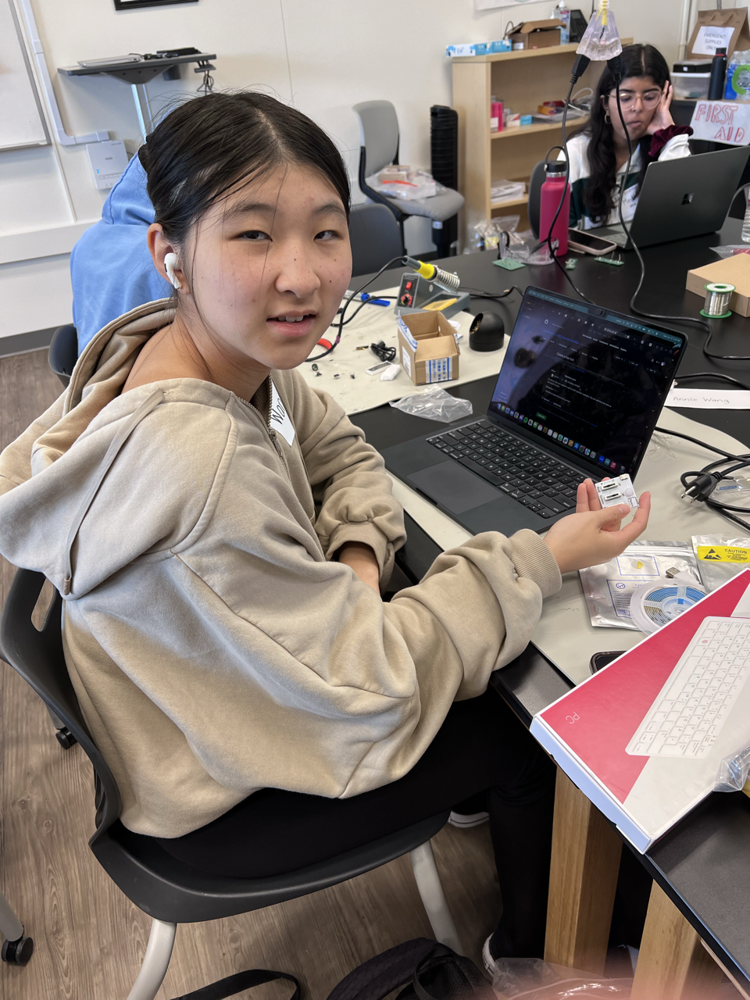
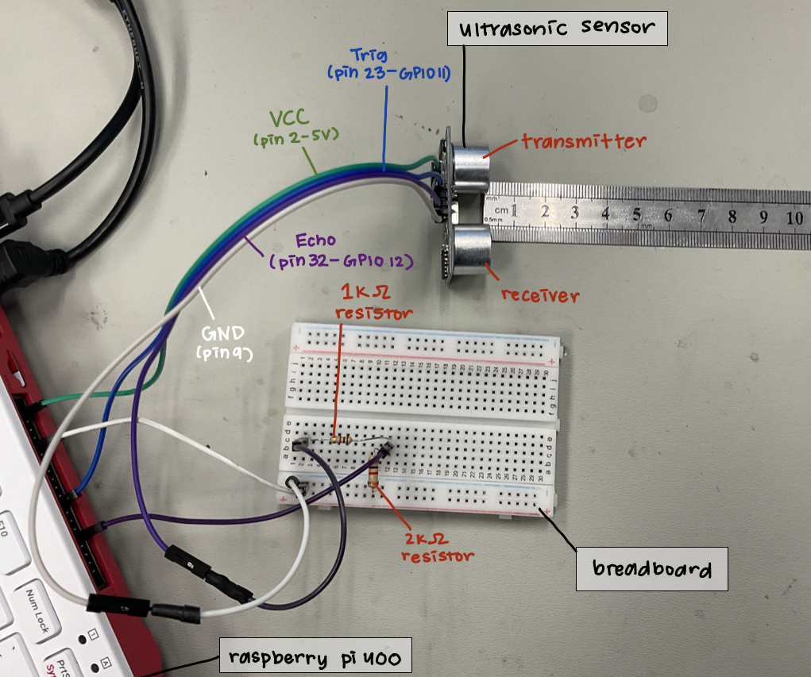

# Smart Mirror
<!--Replace this text with a brief description (2-3 sentences) of your project. This description should draw the reader in and make them interested in what you've built. You can include what the biggest challenges, takeaways, and triumphs from completing the project were. As you complete your portfolio, remember your audience is less familiar than you are with all that your project entails!-->

| **Engineer** | **School** | **Area of Interest** | **Grade** |
|:--:|:--:|:--:|:--:|
| Annie W | Foothill High School | Electrical Engineering | Incoming Senior

<!--**Replace the BlueStamp logo below with an image of yourself and your completed project. Follow the guide [here](https://tomcam.github.io/least-github-pages/adding-images-github-pages-site.html) if you need help.**-->

<h1 align="center"></h1>
  
# Final Milestone

After soldering and sticking the LEDs onto the wood along with the assembly of the mirror, the smart mirror was basically finished. A piece of 18 in x 24in plywood was cut for the monitor to be placed in. Grooves were made into the wood with a router tool for the LEDs to go into. After the plywood was cut, it was painted black. Before mounting the monitor into the plywood and frame, I had to solder and stick the LEDs into place. Since I wanted to make the LEDs go around the monitor, I cut the strip into each side of the rectangle and soldered the corners together. A hole was made at one corner of the grooves for the LED wiring to go through. 

I put a TV mount on top of the monitor. Using that, nylon webbing can be threaded through the holes of the mount and then secured using grommets and screws. The screws are drilled into the back of the plywood. However, there was not a thick enough screw that could hold the eyelets in place without it being drilled into the mirror. Thus, I used shorter screws and secured them using washers. 

Finally, I secured the ultrasonic sensor at the top of the frame, for the time being. I did not secure the raspberry pi in for any further modifications or turning on the mirror. I made final adjustments to the appearance of the smart mirror widgets and covered any imperfections behind the screen with electrical tape.

## Challenges
Many challenges arose from the assembly of the mirror. I did not account that drilling in the screws to secure the grommets could've went through the LED strips, thus damaging them. I had to take apart the mirror to fix the individual LEDs that were broken through soldering. After the LEDs were fixed, I reassembled the mirror and then mounted the monitor, watching where the grommets went. 

I had a lot of difficulty with all of the coding and wiring behind the mirror as well. Often wiring the ultrasonic wrong meant the whole code would terminate itself. I had a faulty ultrasonic once, and I didn't realize until I tried with another ultrasonic sensor. Making sure the ground wire was in place is very important for the LEDs otherwise it could physically damage the LEDs. It was hard to pinpoint what was the issue sometimes, whether it was the code or the circuitry. 

Another challenge was that the code for the LEDs and the ultrasonic sensor could not work together. The LEDs required root access, basically admin, to work. The ultrasonic sensor worked with the command, however, the magic mirror application did not. I could not find a solution for the LEDs and magic mirror to work in one file of code. Thus, I compromised by breaking the necessary code into two. One file had the LED code and the other file had the code for the ultrasonic sensor and the magic mirror. Although it wasn't what I wanted the code to do exactly, this solution allowed the LEDs and mirror to work together.

Despite all of these challenges, all of these issues were resolved for the completion of the mirror. Figuring out each issue in the end was very fulfilling, pushing me forward a step towards the completion of the project. 

## What I Learned
I learned a lot about aspects of electrical and mechanical engineering along with computer science. I already knew a decent amount of coding from taking a class in my school on Java, but I learned about other languages too, including CSS, Javascript, and Python. I learned the most about Python and feel very comfortable using the language. I feel like my familiarity with Python is on par with Java. After learning one language, learning other coding languages is not hard since the basic components are there. Python was a key aspect in making the mirror work since it was necessary for the ultrasonic sensor and LEDs.

I learned about soldering wires together and grew comfortable using a soldering iron, including the safety necessary behind it. I had already worked with circuits on breadboards, but I had never made it permanent through soldering. I learned how a voltage divider works, which was necessary for connecting the ultrasonic sensor. I already learned a bit about how circuits work, but the concept of a voltage divider was new to me. Basically, a voltage divider is a circuit that turns a large voltage into a smaller one. Using a series of resistors, a voltage drop is achieved.

<h1 align="center"></h1>
<h6 align="center">Diagram of a voltage divider. Vout is the desired voltage, which is less than Vin.</h6>
<h1 align="center"></h1>
<h6 align="center">Formula for a voltage divider</h6>

Lastly, I learned a lot about using the different tools necessary for the assembly of the mirror. I learned how to drill in screws to secure the plywood to the frame and then use an impact drill to drill in the screws. The impact drill was necessary for drilling in the grommets into place as well. At first, I felt very intimidated by these tools. However, after learning how they work and the safety needed during their use, I feel a lot more comfortable using these tools.

<!-- For your final milestone, explain the outcome of your project. Key details to include are:
- What you've accomplished since your previous milestone
- What your biggest challenges and triumphs were at BSE
- A summary of key topics you learned about
- What you hope to learn in the future after everything you've learned at BSE

**Don't forget to replace the text below with the embedding for your milestone video. Go to Youtube, click Share -> Embed, and copy and paste the code to replace what's below.**

<iframe width="560" height="315" src="https://www.youtube.com/embed/F7M7imOVGug" title="YouTube video player" frameborder="0" allow="accelerometer; autoplay; clipboard-write; encrypted-media; gyroscope; picture-in-picture; web-share" allowfullscreen></iframe> -->

# Second Milestone
<iframe width="560" height="315" src="https://www.youtube.com/embed/B98T8BYGad0" title="YouTube video player" frameborder="0" allow="accelerometer; autoplay; clipboard-write; encrypted-media; gyroscope; picture-in-picture; web-share" allowfullscreen></iframe>

## Progress
Focusing on the modifications of the MagicMirror, I set up and programmed the ultrasonic sensor to turn on or off the mirror's monitor whether an obstacle is in distance or not. This is to mimic someone standing in front of a mirror, and that certain distance is the distance from the mirror to the person. Basically, if an object is in a certain distance in front of the sensor, the MagicMirror will turn on and stay on as long as the object is within the vicinity. When the sensor cannot detect any obstacles in front of it, it will wait fifteen seconds before turning the mirror off. After the mirror is off, any detected obstacles can turn on the mirror again. In essence, the mirror can be turned on and off multiple times and continuously detect for obstacles to turn on or off the mirror. In addition, I coded the sensor to wait three minutes before terminating the code, so it will stop running after a period of inactivity.

## Challenges
### Wiring the Ultrasonic Sensor
Figuring out how to wire the Raspberry Pi to the ultrasonic sensor was a difficulty that I encountered. The Raspberry Pi 400, similar to a Raspberry Pi 4, has many pins(40  pins) and figuring out which pins that the ultrasonic sensor had to be plugged into was difficult. An ultrasonic sensor has four pins: VCC, GND, Trig, and Echo. VCC and GND are the power supply pins. The trig pin sends an ultrasonic wave, which can hit an obstacle and gets reflected back. The reflected wave is received by the receiver of the sensor and goes from the initial state of HIGH to LOW when the wave is received. In addition, the ultrasonic sensor operates on 5V, but sending a 5V output signal from the echo pin to the GPIO(General Purpose Input/Output) of Rpi would damage the pin since it is rated at 3.3V. Thus, a voltage divider circuit is necessary to turn 5V into 3.3V by using two series resistors.

Plugging in the power supply pins into the correct pins of the Raspberry Pi was the simple part; figuring out the correct set up for the echo and trig pins were the challenging part. The echo pin required the voltage divider pin. With a lot of research, on the Raspberry Pi 400 the trig pin goes into GPIO 11(pin 23) and the echo pin goes into GPIO 12(pin 32). 
<h1 align="center"></h1>
<h6 align="center">Circuit of the ultrasonic sensor, Colorcoded</h6>
<h1 align="center"></h1>
<h6 align="center">Raspberry Pi 400 GPIO Pinout Diagram</h6>


### Coding the Sensor with Python
Another challenge was coding the ultrasonic sensor. I had barely worked with Python before, and figuring out the commands for the ultrasonic sensor took time. Importing modules including time and for circuitry was essential. In addition, I wanted the code to run terminal commands in order to startup or terminate the MagicMirror program. After more research, I grew familiar with Python and found the right commands to code the desired outcome.

## Next Steps
After completing the modifications of the mirror, it is time to move onto the set up and coding of the individual addressable LED lights. After the LED has been set up, the mirror can be assembled: the monitor, the plywood, the LEDs, and the mirror itself. Any last modifications of the MagicMirror display itself can be the final steps prior to its completion.


# First Milestone: Intensive Project-- Smart Mirror

<iframe width="560" height="315" src="https://www.youtube.com/embed/TV7BxGYUKKc" title="YouTube video player" frameborder="0" allow="accelerometer; autoplay; clipboard-write; encrypted-media; gyroscope; picture-in-picture; web-share" allowfullscreen></iframe>

The smart mirror utilizes a monitor to display extra details behind a semi-transparent mirror. These details can be a variety of widgets, ranging from displaying the time, the weather, or upcoming events. In essence, the program I used, MagicMirror2, displays a website. By modifying the code behind what this website displays by utilizing Javascript and CSS, the interface of the mirror can be personalized. For the assembly of the mirror, plywood is needed to hold up the monitor in place. Extra decoration of the mirror includes LED strips that will border the mirror.

### Components

#### Transparent Mirror
The mirror must be transparent for it to display the monitor. Since we are able to see through the mirror and see ourselves in the mirror, we can see what is displayed on the monitor and ourselves. 

#### Monitor
Displays the MagicMirror widgets behind the mirror.

#### Raspberry Pi 400 with MagicMirror2 installed
The Raspberry Pi 400 is basically a Raspberry Pi 4 inside a keyboard. It powers the monitor and the modules of the MagicMirror are edited on the Raspberry Pi. The MagicMirror2 program is primarily coded by Javascript and CSS. CSS "decorates" the appearance of the modules: setting up icons, the structure of widgets, the font, and so on.

Javascript codes for what is displayed and what extra information is needed for the MagicMirror to work. For example, for calendar module, Javascript gets the information necessary from the .ical calendar file provided. Variables set up a maximum of what is displayed or what icon configued by CSS is used.

#### LED Strips
Primarily for decoration. I want a rectangle-shaped strip of LEDs that wrap around the monitor, adjacent to the frame of the mirror. It is plugged into a power strip to be powered. The LEDs comes in one long strand, so the strip will need to be cut into four parts to wrap around the monitor.

#### Monitor Wall Mount, Plywood, Nylon webbing
Components that will be necessary for the assembly and mounting of the mirror. It would look messy if wires or parts that make the mirror work stuck out in view, so the Nylon webbing will keep different components together behind the mirror, stuck to the back with grommets and screws. The plywood is painted black and is used to keep the monitor in place behind the mirror. In addition, the plywood fills up any negative space that the monitor cannot fill, thus making the space behind the mirror all black for it to work. The MagicMirror background is black as well, thus giving a solid color behind the transparent mirror.

#### Ultrasonic Sensor(HC-SR04)
The Ultrasonic Sensor will track nearby movement, thus turning the mirror on when movement is detected near the mirror. Distance from the sensor is calculated by the interaction of the transmitter and receiver. The transmitter emits a chirp that is at a high pitch than the human ear can hear, and it measures the time this sound is bounced off an obstacle. We can code if the time tracked between the obstacle and the sensor in which the time is less than a certain value, the mirror will turn on. This certain value will be calibrated to the time it tracks when someone is standing in front of the mirror.

<h1 align="center"></h1>

## Progress
As of now, I have accomplished setting up the Raspberry Pi and the monitor that will display all the widgets on the screen and the mirror. I tweaked existing widgets like the clock and weather to display the right time and place, giving the correct information for different variables in the code to display the right information. I added and synced up my calendars to display my upcoming events, including holidays, and my friends’ birthdays. In addition, I found other people’s code on adding different modules. I added a widget that would sync up to my Google Tasks and update every ten seconds, thus displaying my list of things I need to do. I went into the code itself to modify the mirror to my own liking. This included changing the font, changing the spacing between each item in a list, and changing and adding icons in the CSS files.

## Challenges
It was somewhat difficult since the program used different coding languages than I used. Javascript and CSS was completely new to me. However, learning new coding languages isn’t very hard as different coding languages have similarities. Reading someone else’s code that is in a language that you don’t recognize was intimidating at first, especially that the MagicMirror program is compiled of many, many folders and files in order for it to work, each filled with code necessary for its operation. Through some trial and error, I was able to personalize the set up of the MagicMirror to my own preference.

## Next Steps
The next thing to do is to assemble the mirror and add the LED strips behind the mirror. This requires the use of drilling tools and a router to put the plywood in place and sticking the LED strips in place. For the LED strips, I need to cut and solder the LED strips into desired length for it to be shaped like a rectangle, bordering the monitor.

<!-- ADD THIS LATER: An extra modification to add would be an ultrasonic sensor to detect movement near the monitor. This would detect movement close to the mirror, turning it on. By then, the Smart Mirror would be complete. Any final adjustments to the interface of the mirror would be the last thing to do.-->

# Starter Project: RGB LED Practice Kit
The RGB LED Practice Kit is mostly for practice with soldering. By incorporating three sliding potentiometers to control each value of the RGB LED(red, green, and blue), the switches can control the color and intensity of the LED with remarkable precision.

The three sliding potentiometers would change the resistance in the circuit, thus changing how potent each value emits. In addition, controlling the resistance would also control the brightness of the LED; a higher resistance would result in a dimmer light and vice versa.

The challenging aspect of this project was wiring the LED. In an LED, there is a longer pin that shows which way is the right way to wire it. The RGB LED has four pins, and one long pin. The board did show where the long pin had to go, so this issue was quickly resolved.

<iframe width="560" height="315" src="https://www.youtube.com/embed/UVZ3a5gztnE" title="YouTube video player" frameborder="0" allow="accelerometer; autoplay; clipboard-write; encrypted-media; gyroscope; picture-in-picture; web-share" allowfullscreen></iframe>

# Schematics 
<!--Here's where you'll put images of your schematics. [Tinkercad](https://www.tinkercad.com/blog/official-guide-to-tinkercad-circuits) and [Fritzing](https://fritzing.org/learning/) are both great resoruces to create professional schematic diagrams, though BSE recommends Tinkercad becuase it can be done easily and for free in the browser. -->

# Code
<!--Here's where you'll put your code. The syntax below places it into a block of code. Follow the guide [here]([url](https://www.markdownguide.org/extended-syntax/)) to learn how to customize it to your project needs. -->
<!-- #after numRandomizer() method
def turnLightOn():
  random = numRandomizer(random)
  if rand == 1:
    rainbow_cycle(0.01) #rainbow ombre
    print("rainbow cycle")
  elif rand == 2:
    red = 86
    green = 245
    blue = 154
    fadeIn(red, green, blue) #aquamarine
    print("aquamarine")
  elif rand == 3:
    red = 247
    green = 57
    blue = 85
    fadeIn(red, green, blue) #pastel magenta
    print("pastel magenta")
  elif rand == 4:
    red = 210
    green = 210
    blue = 252
    fadeIn(red, green, blue) #periwinkle
    print("periwinkle")
  elif rand == 5:
    red = 64
    green = 97
    blue = 245
    fadeIn(red, green, blue) #pastel blue
    print("pastel blue")
  elif rand == 6:
    red = 245
    green = 101
    blue = 91
    fadeIn(red, green, blue) #pink
    print("pink")
  elif rand == 7: 
    red = colorRandomizer(red)
    blue = colorRandomizer(blue)
    green = colorRandomizer(green)
    fadeIn(red, green, blue) #random!
    print("random!!")
  elif rand == 8:
    red = 10
    green = 10
    blue = 200
    fadeIn(red, green, blue) #blue
    print("blue")
  elif rand == 9:
    red = 200
    green = 7
    blue = 7
    fadeIn(red, green, blue) #red
    print("red")
  elif rand == 10:
    red = 150
    green = 150
    blue = 150
    fadeIn(red, green, blue) #white
    print("white")

def turnLightOff():
  if random > 1:
    fadeOut(red, green, blue)
 else:
    pixels.fill((0,0,0))
-->
```
#python3/leds.py
import time
import random
import board
import neopixel

#led setup
pixPin = board.D18
pixCount = 107
ORDER = neopixel.GRB
pixels = neopixel.NeoPixel(pixPin, pixCount, brightness=0.5, auto_write = False, pixel_order = ORDER)

rand = 0
red = 0
green = 0
blue = 0

def wheel(pos):
  # Input a value 0 to 255 to get a color value.
  # The colours are a transition r - g - b - back to r.
  if pos < 0 or pos > 255:
  r = g = b = 0
    elif pos < 85:
      r = int(pos * 3)
      g = int(255 - pos * 3)
      b = 0
    elif pos < 170:
      pos -= 85
      r = int(255 - pos * 3)
      g = 0
      b = int(pos * 3)
    else:
      pos -= 170
      r = 0
      g = int(pos * 3)
      b = int(255 - pos * 3)
    return (r, g, b) if ORDER in (neopixel.RGB, neopixel.GRB) else (r, g, b, 0)

def rainbow_cycle(wait):
  for j in range(255):
    for i in range(pixCount):
      pixel_index = (i * 256 // pixCount) + j
      pixels[i] = wheel(pixel_index & 255)
    pixels.show()
    time.sleep(wait)

def fadeIn(r,g,b):
  p=0
  q=0
  n=0
  while p < r+1 or q < g+1 or n < b+1:
    pixels.fill((p, q, n))
    pixels.show()
    time.sleep(0.01)
    if p < r+1:
      p += 1
    if q < g+1:
      q += 1
    if n < b+1:
      n += 1
  
def fadeOut(r,g,b):
  x=r
  y=g
  z=b
  while x >= 0 or y >= 0 or z >= 0:
    pixels.fill((x,y,z))
    pixels.show()
    time.sleep(0.01)
    if x>0:
      if x > 175:
        x -=4
      elif x > 125:
        x -= 2
      else:
        x -=1
    if y>0:
      if y > 175:
        y -= 4 
      elif y > 125:
        y -= 2
      else: 
        y -= 1
    if z>0:
      if z > 175:
        z -= 4
      elif z > 125:
        z -= 2
    else:
      z-= 1
   if x==0 and y==0 and z==0:
    break
    #print("r: ", x, " g: ", y, "  b: ", z)

def colorRandomizer(num):
  num = random.randint(0,255)
  return num

def numRandomizer(n):
  n = random.randint(1,10)
  return n

while True:
  rand = numRandomizer(rand)
    if rand == 1:
      rainbow_cycle(0.01) #rainbow ombre
      print("rainbow cycle")
    elif rand == 2:
      red = 86
      green = 245
      blue = 154
      fadeIn(red, green, blue) #aquamarine
      print("aquamarine")
    elif rand == 3:
      red = 247
      green = 57
      blue = 85
      fadeIn(red, green, blue) #pastel magenta
      print("pastel magenta")
  elif rand == 4:
      red = 210
      green = 210
      blue = 252
      fadeIn(red, green, blue) #periwinkle
      print("periwinkle")
  elif rand == 5:
      red = 64
      green = 97
      blue = 245
      fadeIn(red, green, blue) #pastel blue
      print("pastel blue")
  elif rand == 6:
      red = 245
      green = 101
      blue = 91
      fadeIn(red, green, blue) #pink
      print("pink")
  elif rand == 7: 
      red = colorRandomizer(red)
      blue = colorRandomizer(blue)
      green = colorRandomizer(green)
      fadeIn(red, green, blue) #random!
      print("random!!")
  elif rand == 8:
      red = 10
      green = 10
      blue = 200
      fadeIn(red, green, blue) #blue
      print("blue")
  elif rand == 9:
      red = 200
      green = 7
      blue = 7
      fadeIn(red, green, blue) #red
      print("red")
  elif rand == 10:
      red = 150
      green = 150
      blue = 150
      fadeIn(red, green, blue) #white
      print("white")

  time.sleep(120)
  if rand > 1:
    fadeOut(red, green, blue)
  else:
    pixels.fill((0,0,0))

  time.sleep(5)

void loop() {
  // put your main code here, to run repeatedly:

}
```
# Bill of Materials
<!--Here's where you'll list the parts in your project. To add more rows, just copy and paste the example rows below.
Don't forget to place the link of where to buy each component inside the quotation marks in the corresponding row after href =. Follow the guide [here]([url](https://www.markdownguide.org/extended-syntax/)) to learn how to customize this to your project needs. -->

| **Part** | **Note** | **Price** | **Link** |
<!--
|:--:|:--:|:--:|:--:|
| DIY Soldering RGB Practice Kit | The Starter Project. Practice for soldering | $7.99 | <a href="https://www.amazon.com/Soldering-Practice-Learning-Electronics-Training/dp/B0BKM3D927"> Link </a> |
|:--:|:--:|:--:|:--:|
| Raspberry Pi 400 | Powers the Smart Mirror. | $70.00 | <a href="https://www.digikey.com/en/products/detail/raspberry-pi/SC0373/13282408"> Link </a> |
|:--:|:--:|:--:|:--:|
| Wireless Mouse | Configures Raspberry Pi for the mirror display. Will be taken out later. | $7.79 | <a href="https://www.amazon.com/Wireless-TECKNET-Receiver-Portable-Adjustable/dp/B095HBY3RF?th=1"> Link </a> |
|:--:|:--:|:--:|:--:|
| Ultrasonic Distance Sensor | Tracks and calculates a person's distance from a mirror to turn on or off the mirror. | $4.50 | <a href="https://www.sparkfun.com/products/15569"> Link </a> |
|:--:|:--:|:--:|:--:|
| Power Strip | Powers Smart Mirror components. | $16.99 | <a href="https://www.amazon.com/gp/product/B092J8LPWR?ie=UTF8&psc=1&linkCode=sl1&tag=qtkwa-20&linkId=2711afc9129fc98b2bd0b14730062c9a&language=en_US&ref_=as_li_ss_tl"> Link </a> |
|:--:|:--:|:--:|:--:| -->
<!--
# Other Resources/Examples
One of the best parts about Github is that you can view how other people set up their own work. Here are some past BSE portfolios that are awesome examples. You can view how they set up their portfolio, and you can view their index.md files to understand how they implemented different portfolio components.
- [Example 1](https://trashytuber.github.io/YimingJiaBlueStamp/)
- [Example 2](https://sviatil0.github.io/Sviatoslav_BSE/)
- [Example 3](https://arneshkumar.github.io/arneshbluestamp/)

To watch the BSE tutorial on how to create a portfolio, click here.-->
